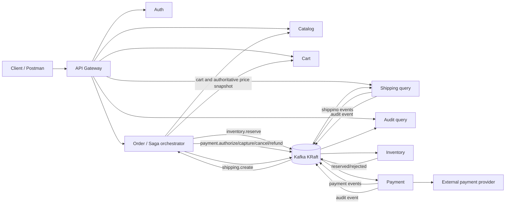

# Architecture

Each state-changing service owns its schema. No service updates another service's database. Business data and its outgoing message are committed together through the transactional outbox; each consumer deduplicates deliveries through its local inbox.

## Checkout sequence

1. The order service obtains the cart and current SKU prices.
2. It atomically stores the idempotency key, immutable order lines, Saga state, and `inventory.reserve` outbox event.
3. Inventory creates a time-limited reservation and atomically allocates stock across rotating striped rows with `FOR UPDATE SKIP LOCKED`, preventing oversell without serializing a hot SKU on one row.
4. Payment authorizes funds using a deterministic provider idempotency key.
5. Inventory converts the reservation to sold stock.
6. Payment captures the authorization.
7. Shipping creates a shipment.
8. The order becomes `COMPLETED`.

Failures emit compensating commands. External money movement is never described as a database rollback: authorization is cancelled, captured money is refunded, committed stock is restocked, and the final result is reconciled from durable state.

## Hot-product paths

Catalog queries use a bounded local Caffeine cache in front of Redis. Concurrent misses are first coalesced per replica, then Redis misses are coordinated by a short token-owned distributed single-flight lock before PostgreSQL is queried. TTL jitter and LFU eviction reduce synchronized expiry and preserve frequently used keys. Short negative entries prevent repeated authoritative 404 lookups from penetrating to PostgreSQL.

Inventory remains database-authoritative. Every SKU is distributed across 16 bucket rows, and each reservation stores its exact allocations. `SKIP LOCKED` prevents lock queues; a zero allocation is classified as either temporary contention or genuine shortage before the Saga is advanced.

Micrometer histogram buckets are scraped by Prometheus and aggregated into fleet p95/p99 recording rules. Product and SKU identifiers are intentionally excluded from metric labels.
